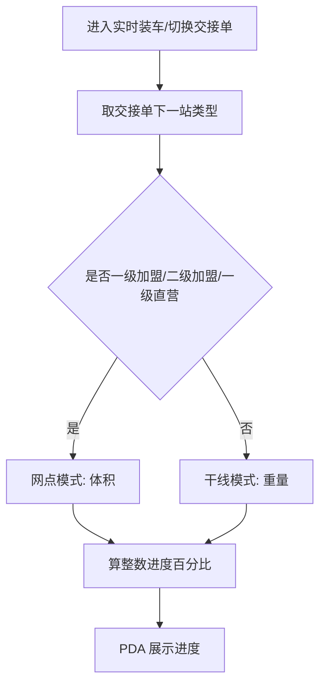

# PDA 装车进度及超载提示

## 1. 背景与价值

| 项 | 说明 |
|---|---|
| 要解决的问题 | PDA「实时装车」不向一线展示已装实际重量后，员工难以判断装车进度、难以预判超载。 |
| 用户调研 | 业务确认：进度统一用百分比展示；须防止通过公示数据反推已装重量绝对值；交接单下一站为网点类用体积、其余干线用重量。 |
| 产品方案 | 后端按重量或体积算进度，前端只展示整数百分比；全国干线/网点两套阈值（预警%、告警%、强制拦截%）；仅强制拦截弹框并禁止继续扫描。 |
| 需求价值 | 在保密约束下恢复进度感知，并按可配阈值做超载管控与强制拦截。 |
| 适用范围 | 全部分拨类型可用；不限制。 |
| 原型 | [实时装车-装车进度原型.html](./实时装车-装车进度原型.html) |

## 2. 保密红线与展示边界

1. PDA **不展示**已装货物实际重量的具体数值。
2. **保留**现网「额定重量」「额定体积」数值展示。
3. 新增装车进度：只展示整数百分比，不标注分子/分母对应已装量含义，不配套已装重量/体积刻度说明。
4. 【风险提醒】一线同时可见额定数值与进度百分比时，可用乘法估算已装量；本需求按业务确认仍同时展示，验收不以「完全不可反推」为标准。

## 3. 装车进度计算

### 3.1 口径判定

按当前装车所用交接单的**下一站网点类型**：

| 模式 | 条件 | 公式 |
|---|---|---|
| 网点（体积） | 下一站为「一级加盟网点」「二级加盟网点」「一级直营网点」 | 已扫子单开单体积合计 ÷ 车辆额定体积 × 100% |
| 干线（重量） | 其余下一站类型 | 已扫子单开单实际重量合计 ÷ 车辆额定载重 × 100% |

### 3.2 展示与刷新

1. 前端只展示后端算出的**整数百分比**：**直接截断小数部分**（不四舍五入）。例：89.9% 展示为 89%。
2. 展示位置：实时装车主页面指标区，在「额定重量」「额定体积」下方（或紧邻）新增「装车进度」。
3. 每完成一票装车扫描、撤货、重量修正后，实时更新进度。
4. **同一次装车过程中**若仅变更下一站导致体积↔重量切换：锁死开装时口径（业务认为基本不会发生）。
5. **切换交接单**：按新交接单下一站重新判定模式并重算进度。

### 3.3 额定缺失

车辆额定载重（干线）或额定体积（网点）缺失时：不展示百分比，展示「未获取到额定重量/体积」。此时不进入预警/告警/强制拦截样式与拦截逻辑。

## 4. 分级样式与强制拦截

### 4.1 全国配置

全国统一维护两套参数，互不共用：

| 参数 | 干线（重量） | 网点（体积） |
|---|---|---|
| 预警阈值% | 可配（示例默认 90） | 可配 |
| 告警阈值% | 可配（示例默认 100） | 可配 |
| 强制拦截阈值% | 可配（与告警分开，不绑死 100） | 可配 |

配置校验：预警% ＜ 告警%；强制拦截% ≥ 告警%。

### 4.2 PDA 表现

取当前模式对应的一套参数。

| 状态 | 条件 | 表现 |
|---|---|---|
| 安全 | 进度 ＜ 预警% | 百分比正常样式；无额外提示 |
| 临近预警 | 预警% ≤ 进度 ＜ 告警% | 百分比黄色；可短震动；**不弹框** |
| 超载告警 | 告警% ≤ 进度 ＜ 强制拦截% | 百分比红色（可红框）；可震动/提示音；**不弹框** |
| 强制拦截 | 进度 ≥ 强制拦截% | **弹框一次** + **禁止继续装车扫描**；震动 + 提示音 |

**弹框正文（已确认）：** 当前装车进度已达强制拦截标准，系统已禁止继续扫描装车。  
**按钮：** 知道了。

弹框规则：

1. 仅强制拦截弹框；预警、告警节点不弹框。
2. 同一装车会话内，进度首次达到强制拦截% 时弹 1 次；关闭后若仍处于拦截态不反复弹。
3. 撤货使进度降到强制拦截% 以下后恢复可扫；之后再次达到强制拦截% 可再弹 1 次。
4. 关闭弹框不等于解除拦截；未撤货降至阈值以下前仍禁止扫描。

## 5. 边界与异常

| 场景 | 规则 |
|---|---|
| 缺额定 | 按上述「额定缺失」展示文案，不算进度、不拦截。 |
| 切换交接单 | 按上述更新模式与进度。 |
| 合车 / 多人同装一车 | 进度以该车（当前装车任务）服务端已装汇总为准，各 PDA 展示同一进度。 |
| 网络异常 / 回传延迟 | 以服务端最近一次成功汇总刷新进度；刷新失败时保留上次成功展示，并允许用户点「刷新」重试。【待确认：是否要弱提示「进度可能不是最新」】 |
| 单票异常重量 | 【待确认：触发条件与局部提示文案；本期若无规则则不做】 |

其余实时装车能力（列表、撤销、发车、破损、切换交接单入口等）沿用现网，本需求不改。

## 6. 验收要点

| 序号 | 验收要点 |
|---|---|
| 1 | 实时装车仍展示额定重量、额定体积；不展示已装实际重量。 |
| 2 | 指标区新增装车进度整数%。 |
| 3 | 下一站为一级加盟/二级加盟/一级直营时，进度按开单体积合计÷额定体积计算。 |
| 4 | 其余下一站时，进度按开单实际重量合计÷额定载重计算。 |
| 5 | 切换交接单后按新下一站重算；同装车中途仅改下一站不切换口径。 |
| 6 | 缺额定时展示「未获取到额定重量/体积」，不弹框、不锁扫。 |
| 7 | 干线、网点两套参数各自含预警%、告警%、强制拦截%，互不影响。 |
| 8 | 预警、告警仅变色（及可选震动/音效），不弹框。 |
| 9 | 达到强制拦截%：弹确认文案、禁止继续扫描；关框后未撤货前仍不可扫；撤货降下去后可再扫。 |
| 10 | 扫描、撤货、重量修正后进度实时更新。 |
