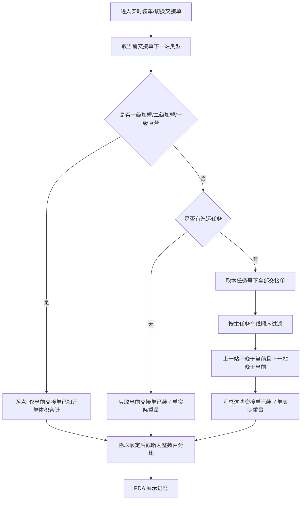

# PDA 装车进度及超载提示

| **需求涉及部门** | **需求确认人** |
| ---------- | --------- |
| 需求提出方      |           |
| 需求提出方负责人   |           |
| 需求负责人      | 胡绵飞       |
| 验收部门负责人    |           |

# 一、概述

## 文档记录

| 版本     | 修订人 | 修订时间      | 修订说明                                           |
| ------ | --- | --------- | ---------------------------------------------- |
| V1.0.0 | 胡绵飞 | 2026.8.12 | 初始版本：PDA 实时装车新增装车进度百分比、干线/网点分级预警与强制拦截；系统参数维护阈值 |

# 二、要解决的问题

| 版本     | 要解决的问题                                                           |
| ------ | ---------------------------------------------------------------- |
| V1.0.0 | PDA「实时装车」不向一线展示已装实际重量后，员工无法判断装车完成程度，也难以预判超载，存在作业节奏难把控与合规/运输安全风险。 |

# 三、业务分析

## 3.1 用户调研

| 版本     | 用户调研                                                                                                                                                                                                                                           |
| ------ | ---------------------------------------------------------------------------------------------------------------------------------------------------------------------------------------------------------------------------------------------- |
| V1.0.0 | 1. 进度统一用整数百分比展示；保留额定重量、额定体积；不展示已装实际重量。 2. 交接单下一站为一级加盟/二级加盟/一级直营按体积，其余干线按重量。 3. 干线需区分有无汽运任务；有汽运任务按主任务车线过滤多交接单；无汽运任务只看当前交接单。 4. 仅强制拦截弹框并禁止装车扫描；预警/告警只变色，不震动、不提示音。 5. 阈值用系统参数维护，干线/网点两套，默认 80/90/100。 6. 网点装时车上若有过境干线货是否要进进度：待业务确认（本期仍按仅当前交接单体积）。 |

## 3.2 产品方案

| 版本     | 产品方案                                                                                                                                                                 |
| ------ | -------------------------------------------------------------------------------------------------------------------------------------------------------------------- |
| V1.0.0 | 1. 实时装车指标区新增「装车进度」整数百分比（直接截断）；按下一站类型走网点体积或干线重量。 2. 干线有汽运任务：按主任务车线顺序汇总应计入本车的交接单已装重量；无汽运任务：只取当前交接单。 3. 系统参数配置预警%/告警%/强制拦截%；达强制拦截时本票不能扫、不入账，仅拦装车扫描。 4. 适用范围：全部分拨类型；不限制。 |

# 四、需求分析

## 4.1 需求价值

| 版本     | 需求价值                                                                                            |
| ------ | ----------------------------------------------------------------------------------------------- |
| V1.0.0 | 1. 一线可按百分比感知装车进度，便于把控作业节奏。 2. 按可配阈值做临近/告警变色与强制拦截，降低超载风险。 3. 干线多交接单按车线取数，避免本站已卸货、下游站同扫货量误计入本站进度。 |

## 4.2 功能点及优先级

| 优先级 | 功能点                             |
| --- | ------------------------------- |
| P0  | 装车进度计算与展示（网点体积 / 干线重量，含有无汽运任务）  |
| P0  | 分级样式（临近黄 / 告警红）与强制拦截弹框、禁止装车扫描   |
| P0  | 系统参数：干线、网点各预警%/告警%/强制拦截%        |
| P1  | 缺额定、切换交接单、单号撤销/撤货重算、网络失败保留上次成功值 |

# 五、详细需求描述

## 5.1 相关链接

### 5.1.1 ones 链接

（待补充）

### 5.1.2 原型

| 版本     | 原型                                     |
| ------ | -------------------------------------- |
| V1.0.0 | [实时装车-装车进度原型.html](./实时装车-装车进度原型.html) |

## 5.2 需求描述

### V1.0.0

#### 展示边界

1. PDA **不展示**已装货物实际重量的具体数值。
2. **保留**现网「额定重量」「额定体积」数值展示。
3. 新增「装车进度」：只展示整数百分比，不标注分子/分母对应已装量含义。
4. 一线同时可见额定数值与进度百分比时，可估算已装量；本需求按业务确认仍同时展示。

其余实时装车能力（列表、发车、破损、切换交接单入口等）沿用现网，本需求不改。

#### 装车进度计算

先按当前装车所用交接单的**下一站网点类型**定模式，再按模式取分子：

| 模式     | 条件                           | 公式                                           |
| ------ | ---------------------------- | -------------------------------------------- |
| 网点（体积） | 下一站为「一级加盟网点」「二级加盟网点」「一级直营网点」 | **仅当前交接单**已扫子单开单体积合计 ÷ 车辆额定体积 × 100%         |
| 干线（重量） | 其余下一站类型                      | **有汽运任务 / 无汽运任务** 分子取数不同（见下），÷ 车辆额定载重 × 100% |

##### 干线分子：有无汽运任务

| 场景        | 分子取数                     |
| --------- | ------------------------ |
| **有汽运任务** | 按下述「任务号下交接单过滤」汇总已装子单实际重量 |
| **无汽运任务** | 只取**当前交接单**已装子单实际重量合计    |

##### 有汽运任务时：任务号下交接单取数

一个任务号下可有多张交接单；系统**不限制**多站同时建交接单扫描（如 A→B→C→D 时，B 在装、C 也可能在扫）。有汽运任务时，干线进度分子只汇总**对本站而言仍算在本车上的交接单货量**。

**取数规则：**

1. 范围：当前**任务号**下全部交接单。
2. 过滤：按**主任务**车线站点顺序，只保留同时满足下面两点的交接单：
  1. 交接单**上一站**在车线顺序上 **不晚于** 当前装车分拨（上一站不晚于当前装车分拨）；
  2. 交接单**下一站**在车线顺序上 **晚于** 当前装车分拨（下一站晚于当前装车分拨）。
3. 汇总：上述交接单中已装子单**实际重量**合计。

含义：本站已卸段不计入；下游站才建的交接单（上一站晚于当前，如 C 正在扫的 C→D）不计入。

**举例 1（有汽运任务，车线 A→B→C，当前在 B 装车）：**

| 本任务下交接单 | 是否计入 | 原因         |
| ------- | ---- | ---------- |
| A→B     | 否    | 下一站=B，本站已卸 |
| A→C     | 是    | 过境仍在车上     |
| B→C     | 是    | 本站装往 C     |

**举例 2（有汽运任务，车线 A→B→C→D，当前在 B 装车；C 可能同时在扫）：**

| 本任务下交接单   | 是否计入 | 原因                                   |
| --------- | ---- | ------------------------------------ |
| A→B       | 否    | 本站已卸                                 |
| A→C / A→D | 是    | 过境仍在车上                               |
| B→C / B→D | 是    | 本站正在装/已装                             |
| C→D       | 否    | 上一站=C 晚于 B；属下游站作业，即使 C 已在扫也不计入 B 的进度 |

**举例 3（无汽运任务）：** 不论任务下是否还有其他交接单，分子只取当前正在装的这一张交接单已装子单实际重量。

网点（体积）分子：仅当前交接单已扫子单开单体积合计（不做干线那套多交接单过滤）。网点装时车上过境干线货是否纳入：待业务确认，确认前按本句执行。

##### 展示与刷新

1. 前端只展示后端算出的**整数百分比**：**直接截断小数部分**（不四舍五入）。例：89.9% 展示为 89%。**预警 / 告警 / 强制拦截的阈值比较，一律用截断后的整数进度。**
2. 展示位置：实时装车主页面指标区，在「额定重量」「额定体积」下方新增「装车进度」。界面以原型为准。
3. 装车扫描成功、撤货、**单号撤销成功**、重量修正后，按上述规则重算并更新进度。
4. **同一次装车过程中**若仅变更下一站导致体积↔重量切换：锁死下载交接单时口径。
5. **切换交接单**：按新交接单下一站重新判定模式并重算进度。

##### 额定缺失

| 模式 | 缺失项 | 展示 |
|---|---|---|
| 干线（重量） | 未取到额定重量 | 不展示百分比，展示「未获取到额定重量」；与额定体积无关 |
| 网点（体积） | 未取到额定体积 | 不展示百分比，展示「未获取到额定体积」；与额定重量无关 |

上述缺失时：不进入预警/告警/强制拦截样式，不锁扫。

#### 系统参数与分级表现

##### 系统参数

用**系统参数**维护，全国统一；干线、网点两套，互不共用。每套 3 个参数：

| 参数      | 干线（重量）默认 | 网点（体积）默认 | 说明           |
| ------- | -------- | -------- | ------------ |
| 预警阈值%   | 80       | 80       | 达到后进入临近预警样式  |
| 告警阈值%   | 90       | 90       | 达到后进入超载告警样式  |
| 强制拦截阈值% | 100      | 100      | 达到后弹框并禁止装车扫描 |

配置校验：预警% 低于 告警%；强制拦截% 不低于 告警%。

参数编码/配置键名跟现网系统参数规范走，本需求只定业务含义与默认值。

##### PDA 表现

取当前模式对应的一套参数。

| 状态   | 条件               | 表现                             |
| ---- | ---------------- | ------------------------------ |
| 安全   | 进度低于预警%          | 百分比正常样式；无额外提示                  |
| 临近预警 | 进度不低于预警%且低于告警%   | 百分比黄色；**不弹框、不震动、不提示音**         |
| 超载告警 | 进度不低于告警%且低于强制拦截% | 百分比红色；**不弹框、不震动、不提示音**         |
| 强制拦截 | 进度不低于强制拦截%       | **弹框一次** + **禁止装车扫描**（本票也不能扫入） |

**弹框正文：** 当前装车进度已达强制拦截标准，系统已禁止继续扫描装车。  
**按钮：** 知道了。

弹框与拦截规则：

1. 仅强制拦截弹框；预警、告警不弹框。
2. **试算拦截：** 若本票扫入后（按截断后整数进度）将达到或超过强制拦截%，则**本票不能扫描、不入账**，并按强制拦截弹框提示。
3. 同一装车会话内，首次触发强制拦截时弹 1 次；关闭后若仍处于拦截态（未撤货/撤销使进度降到强制拦截% 以下）不反复弹，且装车扫描仍禁止。
4. 撤货或单号撤销使进度降到强制拦截% 以下后恢复可扫；之后再次触发强制拦截可再弹 1 次。
5. 关闭弹框不等于解除拦截；进度未降到强制拦截% 以下前仍禁止装车扫描。
6. **仅拦截装车扫描**；发车、切换交接单、无头件、破损等相关操作沿用现网，本需求不因强制拦截额外禁用。

#### 边界与异常

| 场景          | 规则                                   |
| ----------- | ------------------------------------ |
| 缺额定 | 干线缺额定重量展示「未获取到额定重量」；网点缺额定体积展示「未获取到额定体积」；不算进度、不拦截。 |
| 切换交接单       | 按上述更新模式与进度。                          |
| 合车 / 多人同装一车 | 进度以该车（当前装车任务）服务端已装汇总为准，各 PDA 展示同一进度。 |
| 网络异常 / 回传延迟 | 刷新失败时保留上次成功展示的进度；用户可点「刷新」重试。不做额外弱提示。 |
| 单票异常重量局部提示  | **本期不做**。                            |

#### 验收要点

| 序号  | 验收要点                                                 |
| --- | ---------------------------------------------------- |
| 1   | 仍展示额定重量、额定体积；不展示已装实际重量。                              |
| 2   | 指标区新增装车进度；百分比直接截断为整数；阈值比较用截断后的整数进度。                  |
| 3   | 网点：进度=仅当前交接单已扫开单体积合计÷额定体积。                           |
| 4   | 干线有汽运任务：按主任务车线顺序过滤后汇总已装子单实际重量÷额定载重；下游站同时在扫的交接单不计入本站。 |
| 5   | 干线无汽运任务：仅当前交接单已装子单实际重量合计÷额定载重。                       |
| 6   | 切换交接单后按新下一站重算；同装车中途仅改下一站不切换口径。                       |
| 7   | 干线缺额定重量展示「未获取到额定重量」；网点缺额定体积展示「未获取到额定体积」；不弹框、不锁扫。 |
| 8   | 系统参数：干线、网点各含预警/告警/强制拦截三个%；默认 80/90/100；两套互不影响。       |
| 9   | 预警、告警仅变色；不弹框、不震动、不提示音。                               |
| 10  | 本票扫入后将达强制拦截%：本票不能扫描、不入账，弹指定文案；仅拦截装车扫描；发车等其他操作沿用现网。   |
| 11  | 装车扫描、撤货、单号撤销、重量修正后按上述规则重算进度；网络失败保留上次成功值，可刷新。         |
| 12  | 本期无单票异常重量局部提示。                                       |

