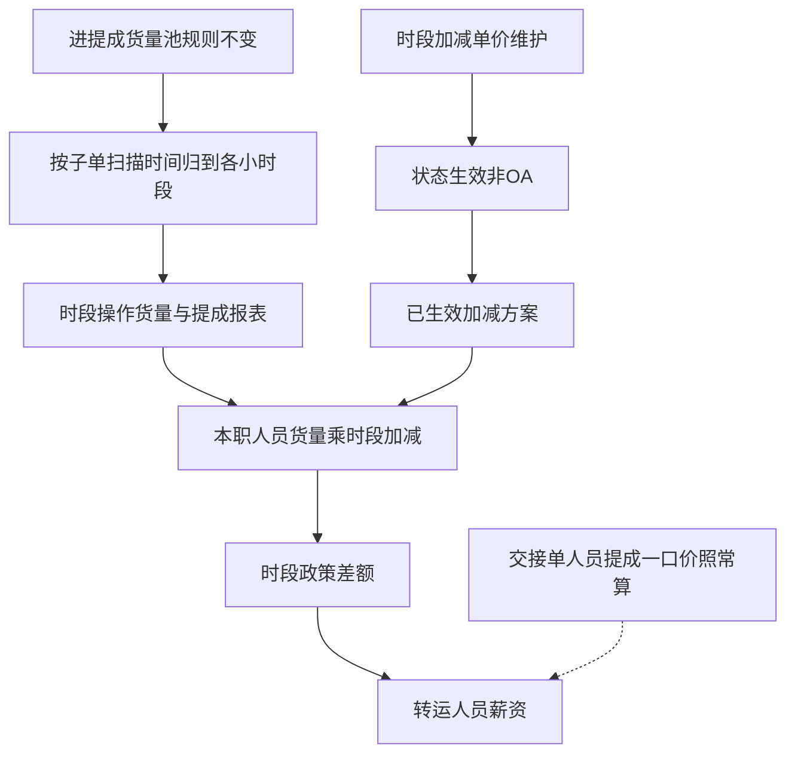
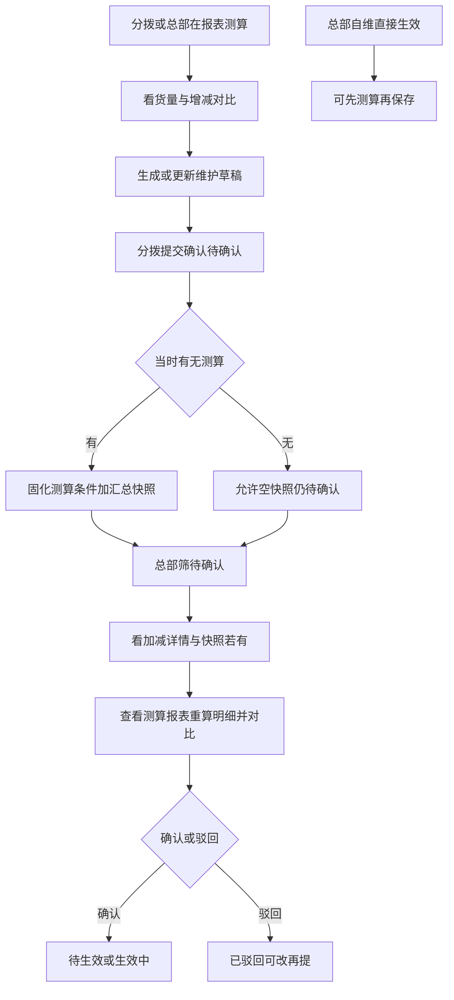

# 区分时间段操作单价（讨论方案）

> 整理日期：2026-09-03  
> 需求负责人：胡绵飞  
> 输入：`区分时间段操作单价对接记录.md`、`提成单价差异化（时间维度）.xlsx`、测算/审核微信对接  
> 说明：讨论方案；含测算→发起→总部审核闭环。本期两页写细；【转运人员薪资】差额列只写挂接要点。

---

## 一、背景与要解决的问题

### 1.1 业务背景

分拨作业里，**把货按时装给网点**往往是整仓节奏的最后一环，也最吃人手。装干线等环节货走不掉时，**省总往往比分拨更急**，现场反而更缺人的是「装网点」等关键窗口（对接举例多在凌晨约 2～5 点一带）。

现网装卸、移动、流水线（卸货 / 码货 / 直装）提成，大体是一口标准单价 × 进池货量：白天班、夜间班、闲时、忙时单价差不多，钱没有跟着「什么时间干了多少」拉开。排班容易铺在白天；关键时段难靠口头集中；线下加减说不清，政策推不动。

业务希望用**时间维度的加减**引导出勤：**不改变**进提成货量池规则，进池后按**子单扫描时间**归到各个小时段；本功能与现网提成算法**完全独立**——现网照常算，本功能单独算出一份「时段差额」，再与正常提成做加减。

### 1.2 要解决的问题

| 序号 | 问题 | 说明 |
|------|------|------|
| 1 | 激励错位 | 一口价无法导向装网点等关键时段 |
| 2 | 看不见、说不清 | 无按小时段的货量与差额，分拨 / 员工对不上 |
| 3 | 算不清、试不了 | 缺测算，细到小时段只能人工导表 |
| 4 | 管不住 | 分拨改加减需总部用状态确认后才生效；总部可直接维护生效 |
| 5 | 不该调的被调到 | 外包、支援、兼职（按本职岗）不参与，且不进报表 / 测算 |
| 6 | 链路断 | 报表可见 + 薪资有「时段政策差额」，才能推政策 |

### 1.3 本期范围

| 在本期 | 不在本期 |
|--------|----------|
| 【时段操作货量与提成报表】（含测算看结果） | 补托 / 未到店扫描单独单价 |
| 【时段加减单价维护】（配方案 + 状态，非 OA） | OA 式审批流；【交接单人员提成】时段下钻或改算法 |
| 【转运人员薪资】增加「时段政策差额」 | 历史月自动重算；可配置合并时段段；流水线移动；员工端 App |
| 业务线：装卸、移动、流水线卸货、流水线码货、流水线直装 | |

**组织适用范围**

- 适用：直营分拨中心、非直营分拨中心、服务站、直营集配站、非直营集配站  
- 不适用：无  

---

## 二、总体怎么算（两页共用）

| 规则 | 结论 |
|------|------|
| 进池 | 与现网一致（装车发车、卸车提交等）；本功能只追加「按扫描时间归到小时段」 |
| 小时段 | `H 点` = `H:00:00`～`H:59:59`；禁止用整单提交 / 发车时刻把一车货记到一个小时。**业务日**：当日 **15 点起至次日 14 点**（展示 / 筛选列序均为 15→…→23→0→…→14，不是自然日 0～23） |
| 标准单价 | **仍在【交接单人员提成】算**；本功能不取、不配标准单价 |
| 本功能金额 | `时段差额 = 时段货量 × 时段加减`（加减、差额均可为负）；移动 = 吨差额 + 托差额 |
| 操作类型 | 与现网一致，只用于套哪套加减（如网点装车→装网点），**不**借用提成算法 |
| 匹配优先级 | 已生效**员工方案**整套优先于**分拨方案**；类型：专属 → 通用 → 加减按 0 |
| 人员 | 见下表；不走加减的人不进报表 / 测算，薪资差额为 0 |

**谁走时段加减**

| 业务线 | 走加减的本职岗位 | 不走（本需求视为兼职等） |
|--------|------------------|--------------------------|
| 装卸 | 装卸工、装卸组长 | 岗位不是装卸工且不是装卸组长；另：外包、支援一律不走 |
| 移动 | 电叉司机、叉车组长、机叉司机 | 岗位不是上述三岗；另：外包、支援一律不走 |
| 流水线卸货 | L卸货员、L卸货组长 | 岗位不是上述两岗；另：外包、支援一律不走 |
| 流水线码货 | L码货员、L码货组长 | 岗位不是上述两岗；另：外包、支援一律不走 |
| 流水线直装 | 只要有操作都走 | **无兼职概念**；仍排除外包、支援 |

**类型与现网操作类型对应（写维护 / 算差额时用）**

| 业务线 | 维护可选类型 | 现网操作类型对应（与【交接单人员提成】一致） |
|--------|--------------|-----------------------------------------------|
| 装卸 | 通用；装网点；卸网点；装干线；卸干线 | 网点装车→装网点；干线装车→装干线；网点卸车→卸网点；干线卸车→卸干线 |
| 移动 | 通用；移网点；移干线 | 网点移动→移网点；干线移动→移干线 |
| 流水线卸货 | 通用；网点卸货；干线卸货 | 与现网流水线卸货操作类型一致（维护 / 报表拆分用「卸货」命名） |
| 流水线码货 | 通用；网点码货；干线码货 | 与现网流水线码货操作类型一致 |
| 流水线直装 | 通用；网点直装；干线直装 | 与现网流水线直装操作类型一致 |

专属类型有维护则用专属加减；否则用通用；再没有则该小时段加减按 0。  
**不按货种 / 品类**区分加减（对接已定）。

**举例（装卸）**

某人某日本职装卸进池 3 票子单：扫描 14:10 / 15:20 / 15:40，吨 1 / 2 / 0.5。  
→ 14 点操作货量 1 吨，15 点 2.5 吨。  
若 14 点加减 -1、15 点加减 0：14 点差额 = 1×(-1) = -1；15 点差额 = 2.5×0 = 0；当日汇总差额 = -1。  
【交接单人员提成】仍按一口标准价算自己的提成；【转运人员薪资】「时段政策差额」取本功能汇总（可为负）。

---

## 三、测算 → 发起 → 总部审核（闭环）

两页分工不变：

| 页面 | 本闭环里干什么 |
|------|----------------|
| 【时段操作货量与提成报表】 | 分拨 / 总部**测算**；看货量与**加多少 / 减多少**；满意后**生成方案草稿** |
| 【时段加减单价维护】 | 配加减；分拨**提交确认**；总部**确认 / 驳回**；从待确认**查看测算** |

组织粒度：测算与对比按**分拨**即可，本期不往分拨以下更细拆。

### 3.1 测算（分拨或总部，都在报表）

1. 查询模式 = 测算；选分拨、日期 / 日期段、业务线 Tab、测算类型（通用 / 装网点等）。  
2. 加减来源：手工配置拟用加减，或引用【时段加减单价维护】里某条方案（含草稿 / 待确认）。  
3. 查询结果：人 × 小时段**货量** + **提成（= 货量 × 加减，可负）**。  
4. **对比（对接已定）**：  
   - 各小时段「提成」列 = 该时段增减额（正=加钱，负=减钱）。  
   - 汇总层必展示「汇总-调整后差额」（套加减后的增减合计），并展示「汇总-调整前差额」对照列（**未套时段加减时为 0**，避免误解成一口价全额）。  
   - 列表上方可展示本查询结果的**本区间增减合计**（各人汇总-调整后差额之和）。  
5. 测算**不进**【转运人员薪资】；不改【交接单人员提成】一口价。  
6. 满意后点**生成方案草稿**：跳转 / 打开【时段加减单价维护】，带入分拨、业务线、类型、24 小时加减；有效期间由用户在维护里补全后保存为草稿。

### 3.2 发起（分拨，维护）

1. 在【时段加减单价维护】完善草稿（有效期间等）后点**提交确认** → 状态变为**待确认**。  
2. **有测算则可固化**：测算条件（分拨、日期段、业务线、类型）+ **汇总增减快照**（如本区间增减合计、人数等，细则 PRD 定）。  
3. **无测算也允许提交**（对接：后面可能没数据仍要收尾）；快照为空，总部仍可审加减本身，也可自己去报表测算。  
4. 类型按**操作类型**分套（卸车 / 装网点 / 装干线等）；**不按货**区分。

### 3.3 总部审核时怎么看测算

| 动作 | 内容 |
|------|------|
| 待确认列表 / 详情 | 看加减、有效期、提交信息；有则展示提交时**增减汇总快照** |
| 查看测算 | 打开【时段操作货量与提成报表】测算模式，带入该方案加减与条件（有固化条件则带入，无则用户自选日期段），**重算明细**，看各时段 / 合计加多少减多少 |
| 总部自己测 | 不依赖分拨提交；直接在报表测算拉某分拨时段货量 + 拟用加减，看对比后再自维生效 |
| 确认 / 驳回 | 状态机；意见留痕 |

明细默认以总部当下**重算**为准；快照仅汇总辅助。快照与重算不一致时，以重算决策。

### 3.4 总部自维

保存后可直接为「生效中 / 待生效」，不走待确认。可先测算再保存。

### 3.5 驳回再提

改加减 → 可再测算 → 再提交；有测算则刷新快照。

---

## 四、【时段操作货量与提成报表】具体方案

### 4.1 页面职责

1. **正式查询**：按已生效加减方案，看本职人员各小时段货量与差额（「提成」列 = 差额）。  
2. **测算**：分拨 / 总部均可；套拟用加减或引用维护方案，同一列表看货量与**增减对比**；可**生成方案草稿**；**不**改正式算薪、**不**直接改维护（生成草稿除外）。

### 4.2 Tab

| Tab | 说明 |
|-----|------|
| 装卸 | 操作货量 + 提成（差额）；拆分类型：装网点 / 卸网点 / 装干线 / 卸干线 |
| 移动 | 移动货量 + 移动托数 + 提成（吨差额+托差额）；拆分类型：移网点 / 移干线 |
| 流水线卸货 | 卸货货量 + 提成；拆分类型：网点卸货 / 干线卸货 |
| 流水线码货 | 码货货量 + 提成；拆分类型：网点码货 / 干线码货 |
| 流水线直装 | 直装货量 + 提成；拆分类型：网点直装 / 干线直装 |

每个业务线 Tab 下均提供二级 Tab「分拨维度 / 人员维度」两套列表（再叠加「货量提成展示」拆分/汇总），表头操作类型随当前业务线变化。

### 4.3 查询条件

| 名称 | 说明 |
|------|------|
| 模式 | 正式查询 / 测算。默认正式查询 |
| 分拨中心 | 分拨中心组件，多选 |
| 人员 | 人员组件，支持多选；仅查本职走加减的人（外包 / 支援 / 兼职不出）。**分拨维度、人员维度均可用**：分拨维度下勾选后，只汇总这些人的货量与提成 |
| 岗位 | 可选；按当前 Tab 本职岗位过滤。**分拨维度、人员维度均可用**：分拨维度下勾选后，只汇总这些岗位的货量与提成 |
| 日期 / 日期段 | 日维度：单日或日期；月 / 段：日期区间。段内各小时段、汇总为区间合计 |
| 操作类型 | 可选；枚举与现网该业务线一致，用于过滤 |
| 货量提成展示 | **按操作类型拆分** / **汇总为一份**（货量与提成联动：拆则都拆，汇总则都汇总为一份） |
| 显示小时段 | **小时段筛选组件**（两种互斥模式，各业务线 Tab 复用；**列序 / 选项序均为业务日 15～14 点**）：①**区间选择**（默认）：开始小时 + 结束小时，按业务日连续选中；起止在业务日序上「倒序」时视为跨业务日起点（如 10～20 = 10～14、15～20）。②**自定义勾选**：按 15→14 排列的复选芯片，可零散勾选。模式切换同步已选小时集合。**默认区间 15～14 点（全业务日）**；**汇总列始终显示** |
| 测算-加减来源 | 仅测算模式：手工填 24 小时加减，或引用【时段加减单价维护】中某条方案（含未生效 / 草稿，便于试算） |
| 测算-业务类型 | 仅测算模式：通用或专属类型，与维护一致 |

### 4.4 按钮

| 名称 | 说明 |
|------|------|
| 查询 | 按条件出列表 |
| 重置 | 清空条件到默认 |
| 导出 | **默认导出列 = 当前勾选显示的列**（含已展开小时段与汇总） |
| 配置拟用加减 | 仅测算 + 加减来源=手工时 |
| 生成方案草稿 | 仅测算；带入分拨、业务线、类型、24 小时加减到【时段加减单价维护】新增草稿 |

维护页「去测算 / 查看测算」：跳转本页测算模式并带入加减（及固化条件若有）。

### 4.5 列表字段

**基础信息（各 Tab 相同）**

| 字段 | 说明 |
|------|------|
| 员工姓名 | |
| 工号 | |
| 岗位 | |
| 分拨 | |
| 日期 / 日期段 | 日或区间 |

**装卸 — 表头分级 + 货量提成展示联动**

业务线 Tab 下用**二级 Tab**切换统计维度（不是查询条件；默认「分拨维度」在前）：

| 二级 Tab | 列表行 | 说明 |
|------|--------|------|
| 分拨维度 | 每个分拨一行 | 看分拨汇总货量与提成；若查询条件选了人员 / 岗位，只汇总这些人 / 这些岗位的数据 |
| 人员维度 | 每人一行 | 看本职人员各小时段货量与提成；人员 / 岗位条件同样过滤列表 |

两套列表都要有；「货量提成展示」在两种维度下同样可用。

查询条件「货量提成展示」控制列粒度（货量与提成**一起**变）：

| 选项 | 每个「汇总 / H点」下二级（或三级）列 |
|------|--------------------------------------|
| 按操作类型拆分 | 装网点、卸网点、装干线、卸干线；每类下再分 **货量、提成**（三级表头） |
| 汇总为一份 | **操作货量、提成**（两级表头）；测算时汇总下提成改为调整前差额、调整后差额 |

| 表头层级 | 内容 |
|----------|------|
| 一级 | 非时间字段上下合并；**汇总**、**H点**各占一组 |
| 拆分时二级 | 操作类型（装网点等） |
| 拆分时三级 | 货量、提成 |
| 汇总时二级 | 操作货量、提成（或测算汇总的差额列） |

| 字段 | 说明 |
|------|------|
| 某类型-货量 | 该小时段该操作类型吨 |
| 某类型-提成 | 该类型货量 × 该类型时段加减（可为负） |
| 操作货量 / 提成（汇总为一份时） | 各类型货量之和；各类型提成之和 |

展示列序：**固定业务日序 15 点 → … → 23 点 → 0 点 → … → 14 点**（与 Excel / 现网业务日一致）。  
**移动 / 流水线**：同样可用「拆分 / 汇总」控制；拆分维度随该业务线操作类型（如移网点 / 移干线）。

**正式查询 vs 测算**

| | 正式查询 | 测算 |
|--|----------|------|
| 加减来源 | 仅**已生效**方案（员工优先于分拨） | 页面拟用加减，或引用维护中指定方案（可未生效） |
| 汇总对比列 | 「汇总-提成」 | 必出「汇总-调整前差额」（未套加减=0）、「汇总-调整后差额」（=套加减后增减合计）；各小时「提成」即该时段增减 |
| 区间合计条 | 无强制 | 列表上方展示本查询**本区间增减合计** |
| 是否进薪资 | 正式差额进【转运人员薪资】 | **不进**薪资 |

### 4.6 人员与货量范围

- 列表**不出现**：外包员工、支援员工、兼职（按第二节本职岗判定）；流水线直装无兼职，但仍排除外包、支援。  
- 货量：与【交接单人员提成】对应业务线进池范围一致，再按子单扫描时间归到小时段。

---

## 五、【时段加减单价维护】具体方案

### 5.1 页面职责

维护分拨层 / 员工层时段加减方案；用**状态**控制是否生效（非 OA）；**不做测算结果明细展示**（明细在报表页）。提供「去测算」「查看测算」；待确认详情可看**增减汇总快照**（可空）。

### 5.2 Tab / 维度

按业务线分 Tab：装卸 | 移动 | 流水线卸货 | 流水线码货 | 流水线直装。  
每个 Tab 内再分：**分拨方案**、**员工方案**（子 Tab）。

### 5.3 查询条件

| 名称 | 说明 |
|------|------|
| 分拨中心 | 多选 |
| 员工 | 仅员工方案；人员组件 |
| 业务线 / Tab | 与当前 Tab 联动 |
| 类型 | 通用及该业务线专属类型，多选 |
| 状态 | 多选：草稿、待确认、已驳回、生效中、待生效、已失效 |
| 有效期间 | 与选择区间有交集的方案 |

### 5.4 按钮

| 名称 | 谁可用 | 说明 |
|------|--------|------|
| 新增 | 分拨 / 总部 | 打开新增弹框 |
| 编辑 | 分拨 / 总部 | 草稿、待确认、已驳回等可编辑；生效中改加减须新方案 + 自动截断（见 5.7） |
| 删除 | 分拨 / 总部 | 仅未生效（草稿 / 待确认 / 已驳回 / 待生效且未到生效日）可删 |
| 提交确认 | 分拨 | 草稿 → 待确认；有测算则固化条件+汇总快照，**无测算也允许提交** |
| 确认生效 / 驳回 | **总部** | 待确认 → 生效中（或待生效）/ 已驳回；填意见，留痕 |
| 去测算 | 分拨 / 总部 | 跳转报表测算，带入当前方案加减 |
| 查看测算 | 总部（待确认为主） | 同「去测算」，优先带入固化测算条件；无条件则自选日期段后重算 |
| 变更记录 | 均 | 查看字段变更与状态意见 |
| 导入 / 下载模板 | 按现网其他提成维护习惯做（细则 PRD 写） | |

**总部直接维护**：保存后可直接为「生效中 / 待生效」，无需再走待确认。

### 5.5 新增 / 编辑字段

| 名称 | 说明 |
|------|------|
| 方案层级 | 分拨 / 员工 |
| 分拨中心 | 必填 |
| 员工 | 员工方案必填 |
| 有效期间 | 必填；起止日期或起止月——与现网提成方案习惯对齐，PRD 定控件 |
| 类型 | 单选：通用或该业务线某一专属类型 |
| 吨加减 / 托加减 | **仅移动**：两套 24 小时加减；其他业务线仅一套按吨（货量）的 24 小时加减 |
| 0～23 点加减（维护录入序） | 按**业务日序 15～14**展示与录入；数字可负可 0 可正；**允许为负** |
| 备注 | 可选 |

**不展示、不维护标准单价。不按货种配置。**

### 5.6 列表字段

| 字段 | 说明 |
|------|------|
| 分拨中心 | |
| 员工 | 分拨方案为空或「-」 |
| 类型 | |
| 有效期间 | |
| 状态 | |
| 测算快照 | 有则显示本区间增减合计等摘要；无则「-」 |
| 创建人 / 创建时间 | |
| 最后修改人 / 时间 | |
| 确认人 / 确认时间 / 意见 | 状态变更留痕摘要 |

24 小时加减在详情 / 编辑弹框展示；列表可「查看加减」。

### 5.7 状态与生效（非 OA）

| 状态 | 含义 |
|------|------|
| 草稿 | 分拨保存未提交 |
| 待确认 | 分拨已提交，等总部改状态 |
| 已驳回 | 总部驳回，可改后再提 |
| 待生效 | 已通过确认，但有效开始日未到 |
| 生效中 | 当前参与正式报表差额与薪资差额 |
| 已失效 | 过期或被截断结束 |

| 谁维护 | 怎么生效 |
|--------|----------|
| 分拨 | 须总部把状态确认通过后才生效 |
| 总部 | 直接生效（或待生效） |

- **有效期交叉**：同一「分拨（+员工）+ 业务线 + 类型」不能并存交叉区间；保存或确认生效时**自动截断**旧方案结束日，保证无交叉。  
- **变更记录**：字段变更要记；状态变更意见要留痕。  
- **已驳回**：允许修改后再次提交确认。  
- **不做历史月自动重算**（靠维护限制方案乱改）。  
- 闭环细节见**第三节**。

### 5.8 员工方案 vs 分拨方案

- 算正式差额时：先找该人 + 分拨 + 类型的**已生效员工方案**；没有再用分拨方案。  
- 员工方案命中则**整套**用员工加减，不与分拨加减混加。  
- 员工方案与分拨方案一样走状态确认。

---

## 六、与【转运人员薪资】挂接（要点）

| 项 | 结论 |
|----|------|
| 新字段 | **时段政策差额** |
| 取值 | 【时段操作货量与提成报表】正式口径下，该人该算薪月各业务线汇总差额之和（可为负） |
| 与现网提成 | **互不改对方算法**；总工资 = 现有各项 + 本差额（具体进合计公式按现网总工资字段习惯，PRD 写清） |
| 【交接单人员提成】 | **不改**页面、不做时段下钻、不改一口价算法 |

---

## 七、明确不做

| 项 | 说明 |
|----|------|
| 本功能取标准单价 | 标准价仍在【交接单人员提成】 |
| 把测算整段落在维护页里看结果 | 测算挂报表；维护只留快照摘要与跳转 |
| 按货种 / 品类差异化 | 对接已定不做 |
| OA 审批流 | 只用状态 |
| 外包 / 支援 / 兼职进报表测算 | 已定排除（直装无兼职） |
| 历史自动重算 | 不做 |
| 存全量测算明细快照 | 只固化汇总快照（可空） |
| 测算下钻到分拨以下 | 对接「不下分分拨」 |
| 补托单独单价 | 另需求 |

---

## 八、建议下一步

1. 原型评审：【时段操作货量与提成报表】【时段加减单价维护】。  
2. 原型确认后写 PRD（维护页 / 报表页结构走对应 skill）。  
3. 【转运人员薪资】增量：仅「时段政策差额」字段与进合计规则。
