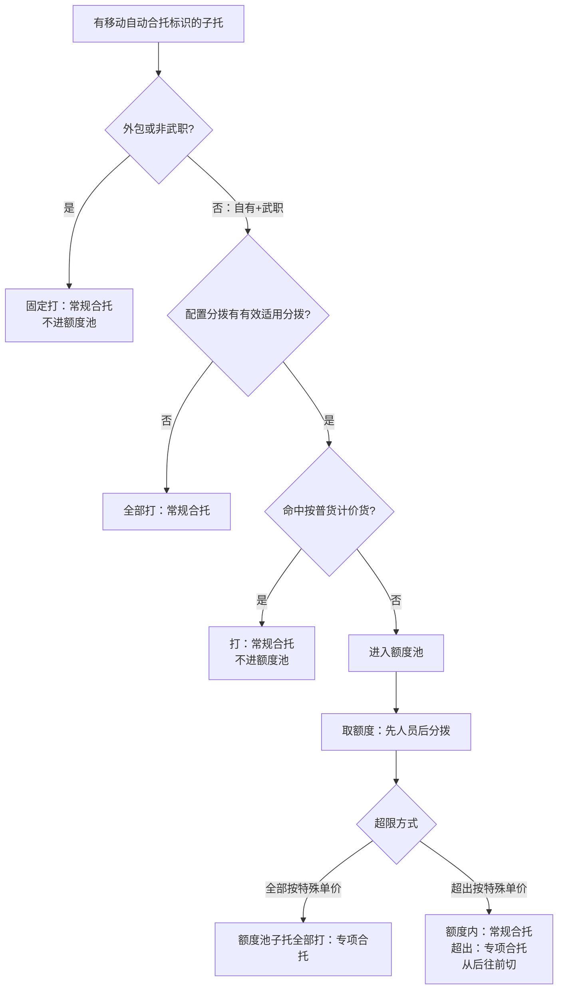

# 移动作业统计（移动自动合托拆分）

|**需求涉及部门**|**需求确认人**|
|---|---|
|需求提出方|运营发展中心/操作部/操作成本部|
|需求提出方负责人|待补充|
|需求负责人|胡绵飞|
|验收部门负责人||

# 一、概述

|**版本**|**修订人**|**修订时间**|**修订说明**|**开发负责人**|**测试负责人**|
|---|---|---|---|---|---|
|V1.0.0|胡绵飞|2026.8.26|【移动作业统计】两块交付：①移动自动合托类型打标；②页面展示——新增查询条件「是否移动自动合托」「移动自动合托类型」筛合托货量（不改移动类型枚举）；明细新增「移动自动合托类型」；失效托数返还逻辑调整（每日移动货量、移动人员明细、数据汇总）。|||

# 二、要解决的问题

|**版本**|**问题**|
|---|---|
|V1.0.0|1. 移动自动合托货量混在现网移动类型里，无法按常规合托 / 专项合托单独核对，难与特殊提成报表、薪资对账；若在「移动类型」下再拆层级，枚举过多、业务难查。 2. 若等到算薪再拆类型，作业统计和报表没有统一基础标签；要在算薪前把类型打到子托上，供本页查询/明细与下游共用。 3. 失效托数返还未区分移动自动合托，专项合托失效若仍按现网返还，托数、货量虚高。|

# 三、业务分析

## 3.1 用户调研

|**版本**|**调研内容**|
|---|---|
|V1.0.0|对接约定：常规合托 / 专项合托要能核对，但不改「移动类型」枚举；用查询条件 + 明细字段区分；特殊金额进单独报表。类型按「移动自动合托提成方案维护」的适用分拨、按普货计价货、人员/分拨额度、超限方式打在子托上；打标在算薪前；一子托=1 托；支援时适用分拨/额度读原分拨，按普货计价货读被支援分拨；超出按移动时间从后往前切。筛货匹配对齐百分比重量习惯。|

## 3.2 产品方案

|**版本**|**产品方案**|
|---|---|
|V1.0.0|落在【移动作业统计】同一能力内两块：①算薪前打移动自动合托类型。②页面不改「移动类型」；新增查询条件筛货，明细加「移动自动合托类型」列；**每日移动货量、移动人员明细、数据汇总**失效托数返还拆成实时移动、移动自动合托两部分（合托侧仅常规合托且备注=「移动并托」；专项合托不进返还）。|

# 四、需求分析

## 4.1 需求价值

|**版本**|**需求价值**|
|---|---|
|V1.0.0|1. 不改移动类型枚举，用查询条件即可筛合托及常规/专项，业务好查。 2. 类型落子托，本页明细与特殊提成报表、薪资共用同一套标签。 3. 失效托数返还按实时移动、移动自动合托两部分处理，专项合托不进返还，避免与特殊提成重复。|

## 4.2 用户群体

|**序号**|**使用岗位**|**使用部门**|**使用频次**|
|---|---|---|---|
|1|操作成本/对账岗|操作成本部等|算薪前后|
|2|分拨运营相关岗位|分拨运营|核对移动自动合托货量时|
|3|研发/测试|产品研发|实现与验收|

## 4.3 优先级及功能点

|**优先级**|**功能点**|
|---|---|
|P0|子托移动自动合托类型打标主流程（含按普货计价货匹配、改配置重打标）|
|P0|新增查询条件「是否移动自动合托」「移动自动合托类型」（不改移动类型枚举）|
|P0|失效托数返还逻辑（每日移动货量、移动人员明细、数据汇总）|
|P0|移动子单/子托明细新增「移动自动合托类型」字段|
|P1|支援 / 转分拨取配置；与特殊提成报表专项合托托数/吨对齐验收|

# 五、详细需求描述

## 5.1 相关链接

|**项**|**说明**|
|---|---|
|配置|`docs/薪资线上化/移动自动合托提成方案维护.md`|
|特殊提成报表|`docs/薪资线上化/移动自动合托特殊提成报表.md`|
|匹配口径参考|`docs/百分比重量/操作结算重量计算逻辑.md`（百分比重量 / 实时特殊匹配习惯）|
|ones|待补充|

## 5.2 权限说明

|**项**|**说明**|
|---|---|
|菜单权限|沿用现网【移动作业统计】，本版不改|
|数据权限|沿用现网，本版不改|

## 5.3 需求描述

### V1.0.0

本文 V1.0.0 分两块：**一、移动自动合托类型打标**（类型怎么打到子托上）；**二、页面展示**（查询怎么筛、明细怎么看、返还怎么算）。先打标、再展示；改配置重打标后，本页跟新类型。

---

#### 一、移动自动合托类型打标

逻辑落在【移动作业统计】侧；类型写在**子托**上（基础数据）。本块**不写**单价怎么取、提成怎么算、薪资怎么展示。

配置读【移动自动合托提成方案维护】。维护页字段枚举不在此重复；**怎么匹配命中**写在下面。

##### 1. 一句话说清

在**算薪之前**，对符合条件的子托打上两种类型之一：

- **常规合托**
- **专项合托**

##### 2. 哪些子托要打

|要打|说明|
|---|---|
|子托有**移动自动合托标识**|一律打「常规合托」或「专项合托」之一；无效托也打，不单独剔除|
|类型只打在**子托**上|一子托=1 托|

|操作人情况|打标结果|是否进额度 / 特殊匹配|
|---|---|---|
|**外包**，或操作时岗位为**非武职**（文职等）|固定打 **常规合托**|否，不占人员/分拨额度，不走适用分拨筛货与超限|
|**自有**且操作时岗位为**武职**|走下文主流程（可能常规合托或专项合托）|是（主流程内判定）|

**武职判定：** 沿用现网「武职岗 / 文职岗」（与【交接单人员提成】【转运人员薪资】一致）。  
**岗位时点：** 取子托**移动操作时**的岗位。

**薪资月（货量月）定义：**  
某月（记为 M 月）的薪资月时间窗为：**M 月 1 日 15:00:00 ～ 次月 1 日 14:59:59**。  

**归属薪资月：** 子托**移动时间**落在哪个薪资月时间窗，就归哪个薪资月（不是日历自然月 0 点～月底）。  

##### 3. 先定「读哪边的配置」

分两套取分拨，不要混用：

|读哪类配置|非支援取谁|支援取谁|
|---|---|---|
|适用分拨、特殊人员额度标准、分拨月额度 / 超限方式|**操作分拨**（移动自动合托实际发生的分拨）|**支援分拨（原分拨）**|
|按普货计价货（筛货）|**操作分拨**|**被支援分拨**（实际干活的分拨）|

下文把「适用分拨 / 额度」用的那一侧叫**配置分拨**；把「按普货计价货」用的那一侧叫**筛货分拨**。  
非支援时两者相同，都是作业分拨。

子托仍是实际扫出来的货。

转分拨：各自分拨各自打标，不乘系数；两边都没超、加总超了的差额本期不管。

##### 4. 主流程

##### 5. 步骤 A — 适用分拨怎么匹配（常规）

从【适用分拨】取满足下面全部条件的记录：

1. 分拨中心 = **配置分拨**  
2. 有效期限包含子托的**归属薪资月**  

|结果|下一步|
|---|---|
|**没有**命中|本批相关子托全部打 **常规合托**，结束|
|**有**命中|进入步骤 B（分拨月额度、超限方式取该条；特殊提成单价本块不读）|

同一分拨同一月按维护页撞期规则最多一条有效启用，不另做优先级。

##### 6. 步骤 B — 按普货计价货怎么匹配（写具体）

目的：判断这个子托算不算「筛出去按普货、不占额度」。  
数据源：【按普货计价货】，只匹配**筛货分拨**下的方案（支援时 = 被支援分拨，见上文）。

匹配逻辑对齐《操作结算重量计算逻辑》里百分比重量 / 实时特殊那套：**空=不限制、非空项越多越优先、区间同行要都满足**。本页没有全国层、没有调整比例。

**6.1 先圈候选方案**

同时满足：

1. 分拨中心 = **筛货分拨**  
2. 有效期限包含子托的**归属薪资月**  

无候选 → **未命中筛货** → 子托进额度池（步骤 C）。

**6.2 候选方案怎么排序**

按「匹配条件数量」从多到少；数量相同再按**创建时间从新到旧**；取排序后第一条去试匹配，不中再试下一条，直到命中或试完。

**匹配条件数量怎么数（维护了非空才 +1）：**

|计入项|说明|
|---|---|
|操作类型、重/抛货、任务类型、上一站、下一站、开单网点/分拨/省区、卸车库区、产品类型、物品类型、物品名称、包装类型、寄件人、是否审报物品、订单来源、是否电商件|有维护值各 +1|
|每启用 1 种区间维度|+1（仅区间模式=按区间配置；不区分计 0）|

**6.3 公共约定**

1. 方案里某匹配条件**未维护（空）** → 视为**不限制**，该项自动通过。  
2. 须维护的项：按下表取业务数据比对，全部通过才算本方案条件命中；再走区间（6.5）。  
3. 条件命中但区间未命中 → 本方案不算命中，试下一条候选。

**6.4 各字段怎么比（对齐百分比重量习惯）**

|匹配条件|业务侧取什么|怎么算命中|
|---|---|---|
|操作类型|本场景固定按**移动**（移动自动合托）|与方案操作类型一致；方案为空则不限制|
|重/抛货|用子单：操作结算重量与实际重量比较。**重货：**操作结算重量 ≤ 实际重量；**抛货：**操作结算重量 > 实际重量|等于方案所选；空则不限制|
|任务类型|按上一站（或方案约定网点）的网点性质归类：分拨=直营/非直营分拨中心；集配站=直营/非直营集配站；服务站=服务站；智运分拨=智运分拨中心；网点=其余|方案多选时，业务归类落在所选集合内即中；空则不限制|
|上一站|移动场景：取**卸车交接单的出库网点**；无交接单按空去比|按方案「上一站网点/分拨/省区」类型，比对维护的网点集合；含「包含二级」时：开单/上一站为二级网点，方案挂了一级且勾了包含二级，可命中。空则不限制|
|下一站|移动场景：取**货区路由下一站**；取不到按空|规则同上一站（类型+集合+包含二级）；空则不限制|
|开单网点/分拨/省区|运单开单网点（及归属分拨/省区）|同上一站的类型+集合+包含二级规则；空则不限制|
|卸车库区|1. **操作类型=卸车或移动：**取**卸车交接单的库区**；无交接单或无库区按空。 2. **操作类型=装车：**取**装车交接单的下一站库区**；无交接单或无库区按空。|方案为空=不限；方案有值则须与上列取到的库区**相同**才中|
|产品类型、物品类型、订单来源|运单/子单对应字段|方案多选：业务值落在集合内即中；空则不限制|
|物品名称、包装类型|运单/子单对应字段|方案「等于」：精准一致；「包含」：业务值包含维护串即可；空则不限制|
|寄件人|运单寄件人|与方案维护值一致；空则不限制|
|是否审报物品|运单是否审报物品|与方案一致；空则不限制|
|是否电商件|子单订单来源是否落在系统参数 `ELECTRIC_EC_ID` 列表内：落在=是，否则=否|与方案一致；空则不限制|

**6.5 区间怎么命中（对齐百分比重量 V2.1.0 写法，范围按本页）**

本页区间维度只有：票-操作结算重量段、票-体积段、件-操作结算重量段、件-体积段。

|区间维度|扫描时取什么|
|---|---|
|票-操作结算重量段|运单操作结算重量|
|票-体积段|运单体积|
|件-操作结算重量段|子单操作结算重量|
|件-体积段|子单体积|

区间判定（同一维度下，配置行按下限从小到大排）：

|段|判定|
|---|---|
|非最后一段|前闭后开：下限 ≤ 实际值 < 上限|
|最后一段|前闭后闭：下限 ≤ 实际值 ≤ 上限（须含上限，例如末段上限=5 时，实际值=5 算命中）|

仅配 1 段时，该段按**最后一段**处理（含上限）。

**区间模式 = 不区分**  
6.4 条件都通过 → **本方案命中**（筛货成功）。

**区间模式 = 按区间配置**

1. 读方案勾选的区间维度，取上表实际值。  
2. **每一个**已勾选维度都必须取到数；任一取不到 → **本方案不命中**，试下一条（不能当「该项不限制」跳过）。  
3. 在配置行里找命中行：**同一行内所有已勾选维度都要落入该行区间（都要满足）**。  
4. 命中 1 行 → 本方案命中；0 行 → 本方案不命中；多行同时命中（配置侧本应禁止重叠）→ 取「各启用维度上限加总更小」的那一行，仍算本方案命中。

**6.6 筛货结果**

|结果|子托怎么处理|
|---|---|
|某条候选方案按上述命中|打 **常规合托**，**不进**额度池|
|所有候选都不命中，或根本无候选|不打最终类型，**进入额度池**，去步骤 C|

##### 7. 步骤 C — 额度用哪条（常规匹配）

只处理**额度池**里的子托。

**先匹配人员额度：**

从【特殊人员额度标准】取同时满足的记录：

1. 分拨中心 = 配置分拨  
2. 人员集合包含该操作人  
3. 有效期限包含**归属薪资月**  

命中后：用**该操作人本人**在额度池内的货量，去比这条方案上的月额度。    

若命中多条（维护页本应撞期禁止），取创建时间最新的一条。

**没有人员额度 → 用适用分拨上的分拨月额度**（步骤 A 已命中，必有）。同样只比**该操作人本人**额度池货量与分拨月额度。

**比什么**

|额度单位|该操作人额度池怎么加总|
|---|---|
|托|**一子托 = 1 托**|
|吨|子托移动操作结算重量（要有百分比逻辑，用计算完百分比过后的）|

加总范围：同一配置分拨 + **同一操作人** + 同一**归属薪资月**（只加该人进额度池的子托）。

##### 8. 步骤 D — 超限方式决定额度池类型

|超限方式（维护页字段名）|标记怎么打|
|---|---|
|全部按特殊单价|全部 → **专项合托**|
|超出按特殊单价|未超出 → **常规合托**；超出 → **专项合托**|

**超出按特殊怎么切到子托：**

1. 额度池子托按**移动时间从后往前**排。  
2. 从后往前累加，直到满「额度池总量 − 月额度」；划入超出的打 **专项合托**，其余打 **常规合托**。  

##### 9. 改配置之后

改了适用分拨 / 按普货计价货 / 特殊人员额度标准 → 只对**当前薪资月**已打类型按新配置**重打**。历史薪资月不自动重打。

##### 10. 串联例子

前提：配置分拨已开适用分拨；分拨月额度 900 托；超限=超出按特殊单价；某人某薪资月移动自动合托 1200 托。

1. 步骤 A：有适用分拨 → 继续。  
2. 步骤 B：200 托命中按普货计价货 → **常规合托**，不进额度池。  
3. 1000 托进额度池；额度 900 → 900 常规合托、100 专项合托（从后往前切）。  
4. 合计：常规合托 1100，专项合托 100。

超限改成全部按特殊单价：筛货 200 仍打常规合托；额度池 1000 全打专项合托。

支援：原分拨 A、在被支援分拨 B 扫 → 适用分拨/额度读 A；按普货计价货读 B；类型打在 B 扫出的子托上。

##### 11. 验收要点（移动自动合托类型打标）

|序号|验收要点|
|---|---|
|1|凡有移动自动合托标识均打标；外包、非武职固定「常规合托」、不占额度；自有+武职走适用分拨/筛货/额度全流程；无效托也打；一子托=1 托。|
|2|打标在算薪前，结果在子托上；不验收取价和提成金额。|
|3|适用分拨：配置分拨+归属薪资月常规匹配；无则全部打常规合托。归属薪资月按 1 日 15:00:00～次月 1 日 14:59:59，不是日历自然月。|
|4|按普货计价货：空条件不限制；按匹配条件数量+创建时间排序；字段取数与重/抛、上一站/下一站、包含二级、电商件等按上文；卸车库区：卸车/移动比对卸车交接单库区，装车比对装车交接单下一站库区。|
|5|区间：不区分则条件过即命中；按区间配置则勾选维度都能取到数，且同行全部落入区间才命中；非末段前闭后开、末段含上限；取不到数则本方案不中。|
|6|命中筛货 → 常规合托且不进额度池；都不中 → 进额度池。|
|7|人员额度优先于分拨；多人挂同一条只共用标准，各人各自比本人额度池货量；单位不一致不混加；托比托、吨比吨。|
|8|超出从后往前切，边界整颗打专项合托；全部按特殊单价则额度池全打专项合托。|
|9|支援：适用分拨/额度读原分拨，按普货计价货读被支援分拨；转分拨各打各的；改配置只重打当前薪资月。|
|10|不交付单独报表、不改薪资字段、不写提成计算（另文）。|

---

#### 二、页面展示

**移动类型**查询条件、汇总维度、明细「移动类型」列：沿用现网，本版不改。合托货量用新增查询条件筛选；明细用「移动自动合托类型」列核对。

##### 查询条件

|名称|控件|说明|
|---|---|---|
|是否移动自动合托|单选下拉框|1. 枚举：全部、是、否。 2. 默认值：全部（不参与过滤）。 3. 查询逻辑：     1. **全部**：不过滤。     2. **是**：仅子托带**移动自动合托标识**。     3. **否**：仅子托**无**移动自动合托标识。|
|移动自动合托类型|单选下拉框|1. 枚举：全部、常规合托、专项合托。 2. 默认值：全部（不参与过滤）。 3. **联动**：是否移动自动合托 = **否** 时，置灰不可选，不参与过滤。 4. 查询逻辑：     1. **全部**：不限制类型。     2. **常规合托 / 专项合托**：子托移动自动合托类型 = 所选值。 5. 与「是否移动自动合托」同时生效时：先按是否收窄，再按类型收窄。|

组合说明：

|想查什么|是否移动自动合托|移动自动合托类型|
|---|---|---|
|和现网一样看全部|全部|全部|
|全部移动自动合托|是|全部|
|仅常规合托|是|常规合托|
|仅专项合托|是|专项合托|
|不含合托的普通移动|否|置灰|
|只看合托失效|是|再叠加现网备注（如无效子托）|

**子单明细过滤：** 子单下**任一子托**命中上述条件即展示该子单。

其余查询条件沿用现网，本版不改。

##### 按钮操作

|按钮|说明|
|---|---|
|导出|沿用现网。「移动子单明细」「移动子托明细」导出增加「移动自动合托类型」字段。|

##### 数据列表

**移动子单明细**

|字段|类型|说明|
|---|---|---|
|移动自动合托类型|新增|1. 取该子单对应子托的移动自动合托类型（常规合托 / 专项合托）。 2. 子单对应子托无移动自动合托：空或「-」。|

其余字段沿用现网，本版不改。

**移动子托明细**

|字段|类型|说明|
|---|---|---|
|移动自动合托类型|新增|1. 展示：常规合托 / 专项合托。 2. 取本文「一、移动自动合托类型打标」。 3. 非移动自动合托子托：空或「-」。|

其余字段沿用现网，本版不改。

**移动人员明细**  
**每日移动货量、数据汇总** 与下列 **失效托数返还逻辑** 相同，本版一并调整。返还按后台日结/月结计算，**不依赖**用户查询勾选。

**失效托数返还逻辑**

返还拆成两部分处理（两部分各自向上取整后相加）：

1. **实时移动**  
   剔除带**移动自动合托标识**的子托；其余沿用现网返还逻辑。

2. **移动自动合托**  
   1. **日结（每天 16:00）**：统计 T-1 日 15:00:00 ～ T 日 15:00:00 每人移动网点、干线托数（移动自动合托）。  
       1. 公式：有效托数 +（失效托数中，备注 =「移动并托」且移动自动合托类型 = 常规合托）× 【分拣合托维护】当月配置的移动返还比例。  
       2. 结果向上取整。  
       3. 日合计与分时合计的差额，加到该员工**前一日最后一小时**托数。  
   2. **月结（每月 1、2、3 日 19:00）**：统计上月 1 日 15:00:00 ～ 本月 1 日 15:00:00，公式同日结；月合计与分时合计的差额，加到该员工**上个月最后一小时**托数。  
   3. **专项合托**：不计入上述返还；只在【移动自动合托特殊提成报表】及本页按「是否=是 + 类型=专项合托」筛出的货量中统计。

注：即在现网逻辑上，增加子托为**移动自动合托**且移动自动合托类型为**常规合托**、备注 =「移动并托」的数据参与返还；专项合托不返还。页面可用「是否移动自动合托」「移动自动合托类型」核对，不依赖「移动类型」枚举。

其余字段沿用现网，本版不改。

**每日移动货量、数据汇总**

失效托数返还逻辑按上述「移动人员明细」执行，本版不改其余展示字段（含移动类型维度）。

##### 验收要点（页面展示）

|序号|验收要点|
|---|---|
|1|「移动类型」查询/汇总/明细展示沿用现网，本版不增「移动自动合托」枚举。|
|2|查询「是否移动自动合托」「移动自动合托类型」按说明过滤；是否=否时类型置灰。|
|3|「移动子单明细」「移动子托明细」有「移动自动合托类型」；子单过滤按任一子托命中。|
|4|失效托数返还：实时移动剔除移动自动合托后沿用现网；移动自动合托按公式返还（备注=移动并托且常规合托），两部分各自取整后相加；专项合托不进返还；每日移动货量、移动人员明细、数据汇总口径一致。|
|5|本页筛「是否=是 + 类型=专项合托」的托数/吨，与【移动自动合托特殊提成报表】同条件可对。|
|6|本页不展示特殊提成金额。|

---
